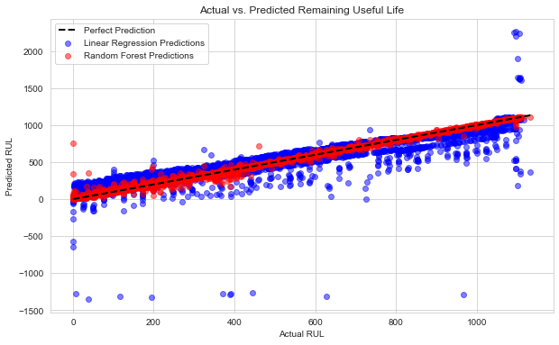

# Predicting Battery Remaining Useful Life (RUL)

## Project Overview
This project aims to predict the Remaining Useful Life (RUL) of lithium-ion batteries using machine learning. By analyzing charge/discharge cycles, voltage, and current characteristics, this model can facilitate proactive maintenance, reduce costs, and improve safety in applications from consumer electronics to electric vehicles.

**Key Skills Demonstrated:** Python, Pandas, Scikit-learn, Seaborn/Matplotlib, Exploratory Data Analysis (EDA), Machine Learning (Linear Regression, Random Forest), Model Evaluation, Data Visualization.

## Problem Statement
Lithium-ion battery failure is a safety risk and a significant cost. The goal is to move from reactive replacement to predictive maintenance by accurately forecasting a battery's end-of-life based on its operational data.

## Dataset
*   **Source:** [Kaggle - Battery Remaining Useful Life (RUL) Prediction](https://www.kaggle.com/datasets/ignaciovinuales/battery-remaining-useful-life-rul?resource=download)
*   **Description:** The dataset contains records of battery charge/discharge cycles. Each cycle has features like discharge time, time at constant voltage, min/max voltage, and charging time. The target variable is the Remaining Useful Life (RUL) in cycles.
*   **Variables:** Cycle Index, F1 (Discharge Time), F2 (Time at 4.15V), F3 (Time Constant Current), F4 (Decrement 3.6-3.4V), F5 (Max. Voltage Discharge), F6 (Min. Voltage Charge), F7 (Charging Time), Total Time, RUL (Target).

## Methodology
1.  **Data Preprocessing:** Handled missing values, checked data integrity, and split data into training/test sets.
2.  **Exploratory Data Analysis (EDA):** Analyzed distributions, trends, and correlations between features and the target (RUL). Identified key relationships, such as the strong non-linear correlation between discharge time and battery health.
3.  **Modeling:** Trained and evaluated two models:
    *   **Linear Regression:** Served as a baseline model.
    *   **Random Forest Regressor:** Used to capture complex, non-linear relationships in the data.
4.  **Evaluation:** Models were evaluated using Mean Absolute Error (MAE), Root Mean Squared Error (RMSE), and R-squared (R²) metrics.

## Results and Key Findings
*   The **Random Forest model** significantly outperformed the Linear Regression model, achieving an R² score of **0.99** and an MAE of **~11 cycles**.
*   **Data Leakage Identified:** Initial near-perfect results (R² > 0.999) were traced to the `Cycle Index` feature, which directly calculates RUL. Removing it led to a more realistic and robust model.
*   **Feature Importance:** The Random Forest model identified `Discharge Time (F1)` and `Voltage Decrement (F4)` as the most important predictors, despite their low linear correlation with RUL. This highlights the model's ability to identify critical non-linear relationships that a simple correlation analysis might miss.
*   **Linear Regression Analysis:** confirmed that `Min. Voltage Charge (F6)` had the strongest *linear* relationship with RUL, aligning with initial correlation analysis.

**Final Model Performance (Random Forest)**
| Metric | Value |
| :--- | :--- |
| Mean Absolute Error (MAE) | 11.07 cycles |
| R-squared (R²) | 0.9926 |

## Conclusion
This project successfully demonstrates a data-driven framework for predicting battery health. The results show that machine learning, particularly Random Forests, can effectively model complex battery degradation patterns using readily available operational data. This work provides a foundation for building predictive maintenance systems that can save costs and enhance reliability.

## Future Work
*   Experiment with other algorithms like Gradient Boosting (XGBoost, LightGBM) or LSTMs for time-series analysis.
*   Incorporate more data from diverse battery types and usage conditions to improve model generalizability.
*   Develop a prototype dashboard for real-time battery health monitoring (similar project I have done for real-time car monitoring dashboard available in my github profile).